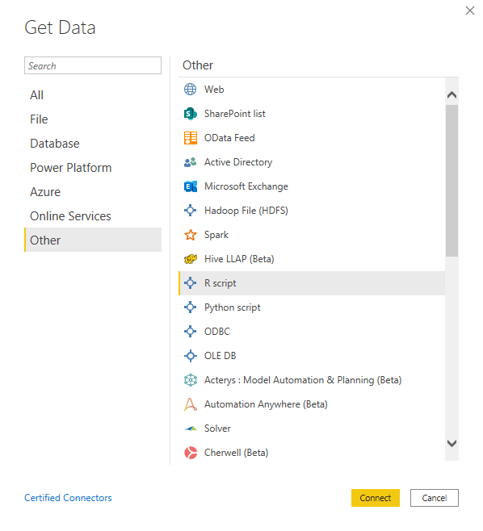
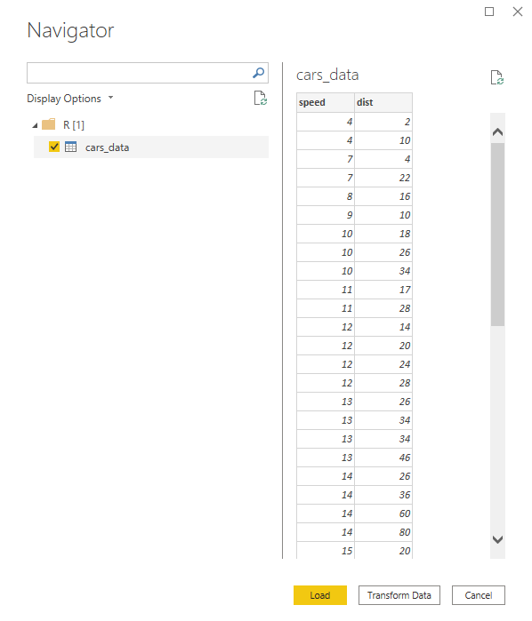
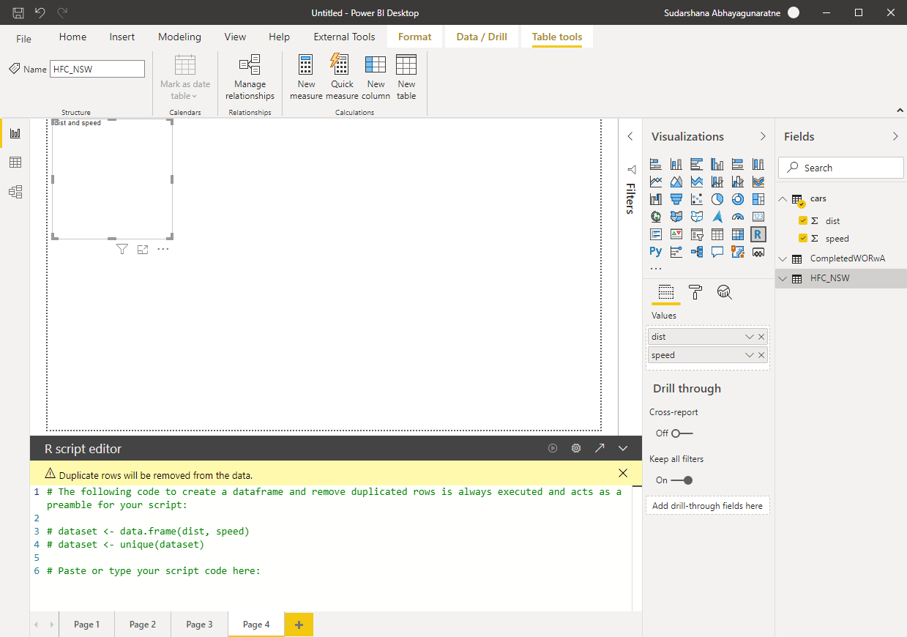

-   [Prerequisite](#prerequisite)
    -   [R Installation](#r-installation)
    -   [R IDE](#r-ide)
    -   [Power BI Options](#power-bi-options)
-   [Import Data](#import-data)
    -   [Example 1 - Connect to available dataset in
        R](#example-1---connect-to-available-dataset-in-r)
    -   [Example 2 - import csv, xlsx, sql etc. to R /
        transform](#example-2---import-csv-xlsx-sql-etc.-to-r-transform)
-   [Tranform Data](#tranform-data)
-   [Visualisations](#visualisations)

Prerequisite
------------

### R Installation

-   R must be installed on the same Windows computer as Power BI Desktop

<a href="https://www.r-project.org/" class="uri">https://www.r-project.org/</a>

Australia - mirrors

<table>
<colgroup>
<col style="width: 50%" />
<col style="width: 50%" />
</colgroup>
<tbody>
<tr class="odd">
<td><a href="https://cran.csiro.au/" class="uri">https://cran.csiro.au/</a></td>
<td>CSIRO</td>
</tr>
<tr class="even">
<td><a href="https://mirror.aarnet.edu.au/pub/CRAN/" class="uri">https://mirror.aarnet.edu.au/pub/CRAN/</a></td>
<td>AARNET</td>
</tr>
<tr class="odd">
<td><a href="https://cran.ms.unimelb.edu.au/" class="uri">https://cran.ms.unimelb.edu.au/</a></td>
<td>School of Mathematics and Statistics, University of Melbourne</td>
</tr>
<tr class="even">
<td><a href="https://cran.curtin.edu.au/" class="uri">https://cran.curtin.edu.au/</a></td>
<td>Curtin University</td>
</tr>
</tbody>
</table>

</br>

### R IDE

-   Good to have

IDE to use with R, Notepad++, R Studio, VS etc.

### Power BI Options

We can verify correct R installation and detected IDEs by opening
*Options* dialog box. Also using this we can provide a specific R
installation and R IDE to use with Power BI.


Import Data
-----------

To import data you need to create a dataframe. Power BI can access the
dataframes and you can select required dataframes to import.

-   Connect to available dataset in R
-   import csv, xlsx, sql etc. data to R then connect
-   import data to R, transform, clean up data and then connect

### Example 1 - Connect to available dataset in R

We can use available dataset in R and import this to Power BI

`cars` dataset in R consist of breaking distances vs. speed data.

we can preview the data using `head()` function.

``` r
head(cars)
```

    ##   speed dist
    ## 1     4    2
    ## 2     4   10
    ## 3     7    4
    ## 4     7   22
    ## 5     8   16
    ## 6     9   10

Lets import this dataset to Power BI by assigning to a dataframe.

In **Power BI**, click *Get Data -\> Other -\> R script*



Click Connect

Use the following R script to get the data from *cars* dataset.

``` r
cars_data <- cars
```


Click OK

We can select required dataframe to Load/Tranform in Power BI

 

### Example 2 - import csv, xlsx, sql etc. to R / transform

``` r
library(readxl)

CompletedWORwA <- read_excel("C:/<directory path>/CompletedWORwA.xlsx")

HFC_NSW <- subset(CompletedWORwA, TECHNOLOGY =='HFC' & STATE == 'NSW')
```

Power BI Navigator


Tranform Data
-------------

We can transform Power BI data using R scripts. Power BI Query Editor
can apply R Scripts to a dataset in order to transform the data.


``` r

library(dplyr)

output <- summarise(group_by(dataset,TECHCODE), freq = n())

```


Visualisations
--------------

Use R button on the Visualizations pane, this adds a graphic placeholder
to the report and opens the R script editor pane.

We need to select required columns from the Fields pane, or drag columns
to Values section of the Visulisations pane in Power BI.



Select `dist` and `speed` from the cars dataset and use below script to
show scatter plot of dist vs speed.

``` r

# The following code to create a dataframe and remove duplicated rows is always executed and acts as a preamble for your script: 

# dataset <- data.frame(dist, speed)
# dataset <- unique(dataset)

# Paste or type your script code here:
plot(dataset$speed, dataset$dist)
```


